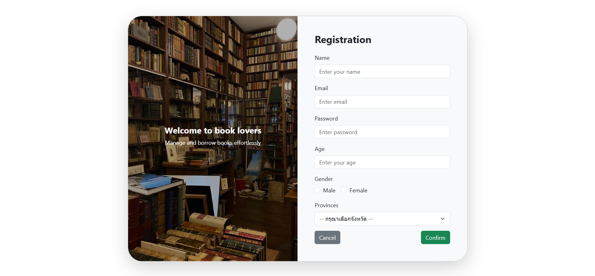
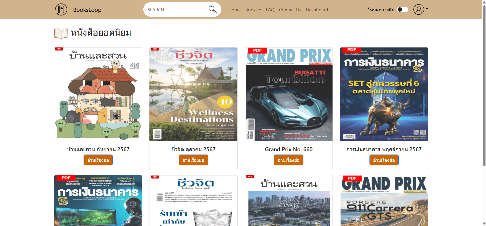
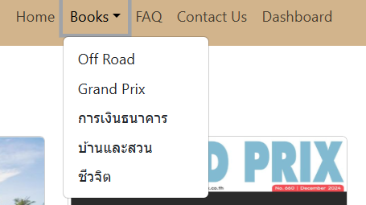
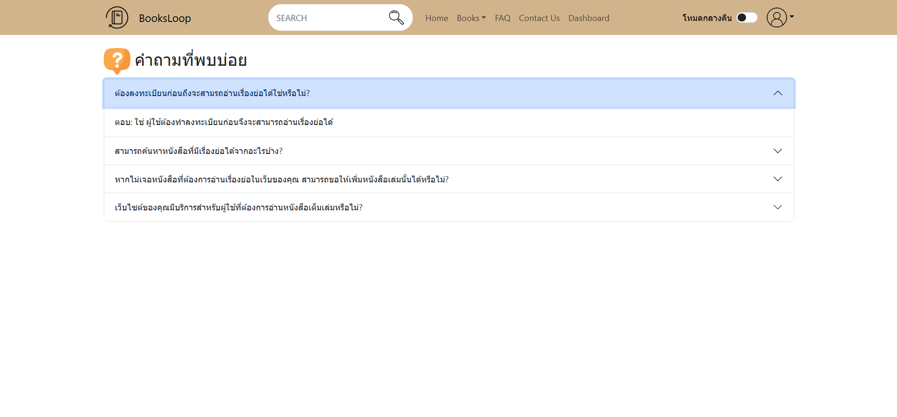
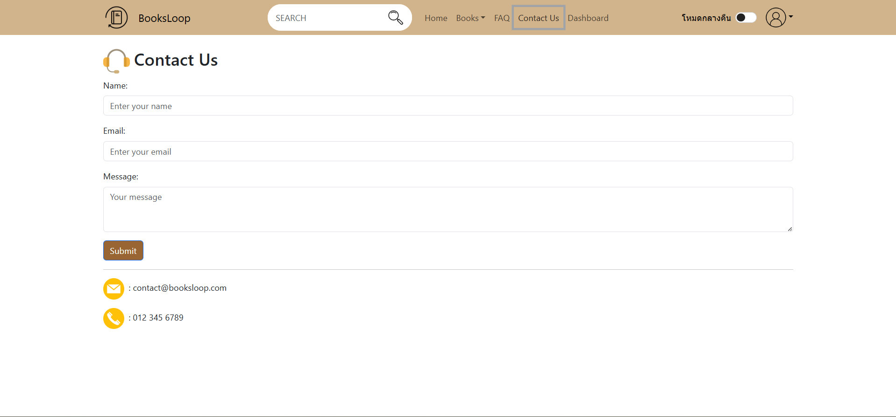
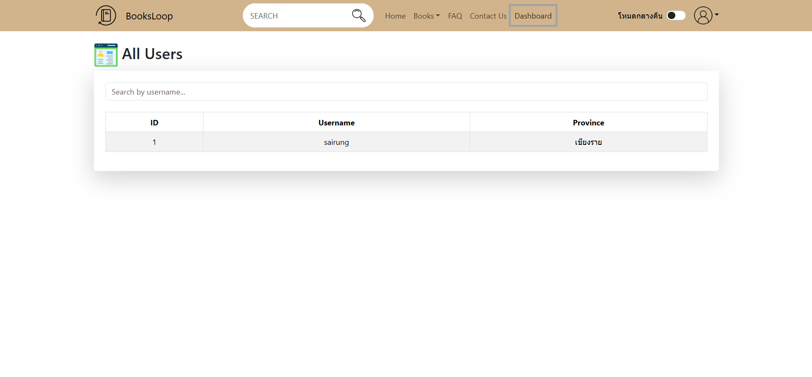
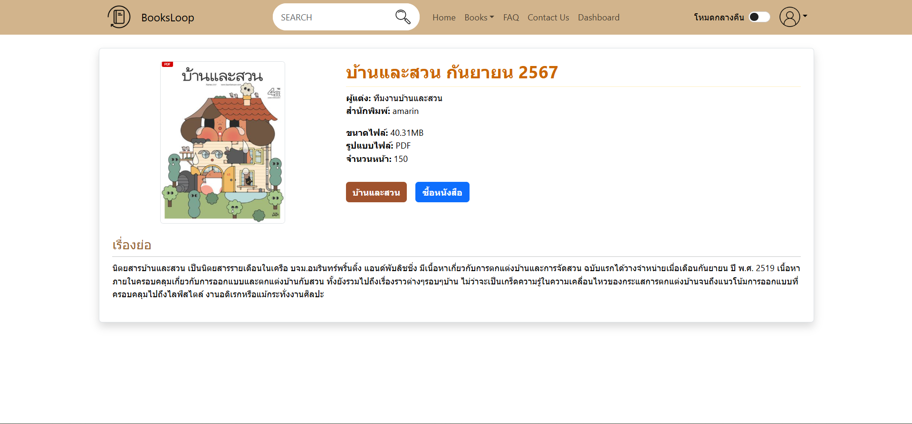

# 📚 Book Recommendation Platform

A web application developed with React that helps users discover popular books, read book summaries, and purchase books through trusted online bookstores.

---

## 🌟 Project Overview

The Book Recommendation Platform was developed to help readers discover books that match their interests from a large collection of available titles. Users can browse books by category, view detailed information and summaries, and purchase books directly through online bookstores.

The platform provides a simple, modern, and user-friendly experience while supporting responsive design across desktop, tablet, and mobile devices.

---

## 🎯 Objectives

* Recommend popular books from various categories.
* Provide detailed information and summaries for each book.
* Help users make informed purchasing decisions.
* Connect users with trusted online bookstores.
* Deliver a modern and responsive user experience.

---

## 🛠️ Technologies Used

### Frontend

* React.js
* React Router DOM
* Bootstrap
* React Bootstrap

### Backend

* PHP

### Database

* MySQL
* phpMyAdmin
* XAMPP

### Development Tools

* Visual Studio Code
* Git
* GitHub

### 🗄️ Database Integration

The platform is connected to a MySQL database managed through phpMyAdmin on XAMPP to store and manage user information efficiently.

Database functionalities include:

* User registration data storage
* User login authentication
* User account management
* Displaying total registered users on the Dashboard
* Efficient data storage and retrieval
* Integration between React Frontend and MySQL Database through PHP Backend

---

## 🚀 Key Features

### 🔐 Authentication System

* User Registration
* User Login
* Secure User Authentication

#### 🔐 Registration Page

Users can create an account to access platform features securely and conveniently.



#### 🔑 Login Page

Users can securely log in to manage their accounts and access the book recommendation system.


---

## 🏠 Home Page

Displays popular books along with search and category filtering functionality.

Features:

* Display popular books
* Search books by title
* Filter books by category
* Card-based responsive layout
* Mobile-friendly design
* Modern and user-friendly interface



---

### 📚 Category Filtering

Allows users to browse books based on categories and interests.



---

### ❓ FAQ Page

* Provides answers to frequently asked questions
* Helps users quickly understand platform functionality
* Reduces the need to contact support for common issues



---

### 📞 Contact Us Page

* Allows users to report issues or request assistance
* Provides a communication channel between users and administrators
* Improves the overall support experience



---

### 📊 Dashboard Page

* Displays the total number of registered users
* Shows platform usage statistics
* Helps administrators monitor platform performance
* Supports user management and analytics



---

## 📖 Book Details Page

Provides detailed information about each book, including:

* Book cover image
* Book title
* Author name
* Category
* Thai book summary



---

### 🛒 Book Purchase System

* Purchase buttons redirect users to online bookstores
* Allows users to buy books directly from trusted retailers
* Supports bookstores such as Naiin, SE-ED, and B2S


---

## 📂 Project Structure

```bash
src/
│
├── components/
│   ├── Navbar.jsx
│   └── BookCard.jsx
│
├── pages/
│   ├── Home.jsx
│   ├── BookDetails.jsx
│   └── Databooks.jsx
│
├── App.js
├── index.js
└── assets/
```

---

## ⚙️ Installation

### Clone Repository

```bash
git clone https://github.com/yourusername/book-recommendation-platform.git
```

### Navigate to Project Directory

```bash
cd book-recommendation-platform
```

### Install Dependencies

```bash
npm install
```

### Run the Application

```bash
npm start
```

The application will be available at:

```bash
http://localhost:3000
```

---

## 📱 Responsive Design

The platform is fully responsive and supports:

* Desktop Devices
* Tablets
* Mobile Devices

---

## 🔮 Future Improvements

* User Profile Management
* Favorite Books Feature
* Book Ratings and Reviews
* Advanced Recommendation Algorithm
* AI-Powered Book Recommendations
* Multi-language Support
* Dark Mode

---

## 👩‍💻 Developer

This project was developed as part of a Web Development learning project using React, PHP, and MySQL. The goal is to create a modern and user-friendly book recommendation platform that helps users discover and purchase books more efficiently.

---
# ระบบแนะนำหนังสือออนไลน์

เว็บแอปพลิเคชันสำหรับแนะนำหนังสือยอดนิยม พัฒนาด้วย React เพื่อช่วยให้ผู้ใช้งานค้นหาหนังสือที่ตรงกับความสนใจ อ่านเรื่องย่อ และเชื่อมต่อไปยังร้านหนังสือออนไลน์สำหรับการสั่งซื้อ

---

## 🌟 ภาพรวมโครงการ

Book Recommendation Platform ถูกพัฒนาขึ้นเพื่อช่วยแก้ปัญหาการค้นหาหนังสือที่น่าสนใจจากข้อมูลจำนวนมาก โดยผู้ใช้งานสามารถเลือกดูหนังสือตามหมวดหมู่ อ่านรายละเอียดและเรื่องย่อของหนังสือ รวมถึงกดปุ่มซื้อเพื่อไปยังเว็บไซต์ร้านหนังสือออนไลน์ได้โดยตรง

---

## 🎯 วัตถุประสงค์

* แนะนำหนังสือยอดนิยมจากหลากหลายหมวดหมู่
* แสดงรายละเอียดและเรื่องย่อของหนังสือ
* ช่วยให้ผู้ใช้งานตัดสินใจก่อนซื้อหนังสือ
* เชื่อมต่อกับร้านหนังสือออนไลน์ที่น่าเชื่อถือ
* พัฒนาเว็บไซต์ที่ใช้งานง่ายและรองรับทุกอุปกรณ์

---
## 🛠️ เทคโนโลยีที่ใช้

### Frontend

* React.js
* React Router DOM
* Bootstrap
* React Bootstrap

### Backend

* PHP

### Database

* MySQL
* phpMyAdmin
* XAMPP

### เครื่องมือสำหรับพัฒนา

* Visual Studio Code
* Git
* GitHub

### 🗄️ ระบบฐานข้อมูล

ระบบมีการเชื่อมต่อกับฐานข้อมูล MySQL ผ่าน phpMyAdmin บน XAMPP เพื่อจัดเก็บและจัดการข้อมูลผู้ใช้งานภายในแพลตฟอร์ม

ความสามารถของระบบฐานข้อมูลประกอบด้วย

* จัดเก็บข้อมูลการสมัครสมาชิก (Registration)
* จัดเก็บข้อมูลการเข้าสู่ระบบ (Login)
* จัดการข้อมูลบัญชีผู้ใช้งาน
* แสดงจำนวนผู้ใช้งานทั้งหมดบนหน้า Dashboard
* จัดเก็บและเรียกใช้ข้อมูลอย่างมีประสิทธิภาพ
* รองรับการเชื่อมต่อระหว่าง React Frontend และฐานข้อมูล MySQL ผ่าน PHP Backend

---
## 🚀 ฟีเจอร์หลัก
### 🔐 ระบบสมาชิก

- สมัครสมาชิก (Registration)
- เข้าสู่ระบบ (Login)
- ระบบยืนยันตัวตนผู้ใช้งาน

🔐 Registration Page

ผู้ใช้งานสามารถสมัครสมาชิกเพื่อเข้าถึงฟีเจอร์ต่าง ๆ ของระบบได้อย่างสะดวกและปลอดภัย


🔑 Login Page

ผู้ใช้งานสามารถเข้าสู่ระบบเพื่อจัดการข้อมูลส่วนตัวและใช้งานระบบแนะนำหนังสือได้


## 🏠 Home Page

แสดงหนังสือยอดนิยม พร้อมระบบค้นหาและหมวดหมู่หนังสือ
* แสดงหนังสือยอดนิยม
* ค้นหาหนังสือจากชื่อหนังสือ
* กรองหนังสือตามหมวดหมู่
* แสดงผลแบบ Card Layout
* รองรับการใช้งานบนมือถือ
* ออกแบบ UI ให้ใช้งานง่ายและทันสมัย


---

### 📚 Category Filtering

แสดงหมวดหมู่หนังสือ


---
### ❓ หน้า FAQ

- รวมคำถามที่พบบ่อยเกี่ยวกับการใช้งานเว็บไซต์
- ช่วยตอบข้อสงสัยของผู้ใช้งานได้อย่างรวดเร็ว
- ลดปัญหาและคำถามที่ต้องติดต่อผู้ดูแลระบบ

  
---
### 📞 หน้า Contact Us

- ช่องทางติดต่อเมื่อพบปัญหาในการใช้งาน
- ส่งคำถาม ข้อเสนอแนะ หรือแจ้งปัญหาให้ผู้ดูแลระบบ
- เพิ่มความสะดวกในการรับความช่วยเหลือ
  
---
### 📊 หน้า Dashboard

- แสดงจำนวนผู้ใช้งานทั้งหมดในระบบ
- แสดงสถิติการใช้งานเว็บไซต์
- ช่วยให้ผู้ดูแลระบบติดตามข้อมูลภาพรวมของแพลตฟอร์ม
- รองรับการบริหารจัดการข้อมูลผู้ใช้งาน
  
---
## 📖 Book Details Page

* รูปปกหนังสือ
* ชื่อหนังสือ
* ชื่อผู้แต่ง
* หมวดหมู่
* เรื่องย่อภาษาไทย


---
### 🛒 ระบบสั่งซื้อหนังสือ

- ปุ่มซื้อหนังสือเชื่อมต่อไปยังร้านหนังสือออนไลน์
- นำผู้ใช้งานไปยังหน้าสั่งซื้อหนังสือโดยตรง
- รองรับร้านหนังสือออนไลน์ เช่น Naiin, SE-ED และ B2S


---

## 📂 โครงสร้างโปรเจกต์

```bash
src/
│
├── components/
│   ├── Navbar.jsx
│   └── BookCard.jsx
│
├── pages/
│   ├── Home.jsx
│   ├── BookDetails.jsx
│   └── Databooks.jsx
│
├── App.js
├── index.js
└── assets/
```

---

## ⚙️ วิธีติดตั้ง

### Clone โปรเจกต์

```bash
git clone https://github.com/yourusername/book-recommendation-platform.git
```

### เข้าโฟลเดอร์โปรเจกต์

```bash
cd book-recommendation-platform
```

### ติดตั้ง Dependencies

```bash
npm install
```

### เริ่มต้นใช้งาน

```bash
npm start
```

เปิดผ่าน Browser:

```bash
http://localhost:3000
```

---

## 📱 การรองรับอุปกรณ์

รองรับการใช้งานบน

* คอมพิวเตอร์
* แท็บเล็ต
* โทรศัพท์มือถือ


---
## 🔮 การพัฒนาในอนาคต

* ระบบสมาชิก
* ระบบบันทึกหนังสือโปรด
* ระบบให้คะแนนและรีวิว
* ระบบแนะนำหนังสืออัจฉริยะ
* AI Recommendation
* รองรับหลายภาษา

---

## 👩‍💻 ผู้พัฒนา

พัฒนาขึ้นเพื่อการศึกษาและการเรียนรู้ด้าน Web Development, React และ User Interface Design โดยมุ่งเน้นการสร้างแพลตฟอร์มแนะนำหนังสือที่ใช้งานง่ายและทันสมัย
